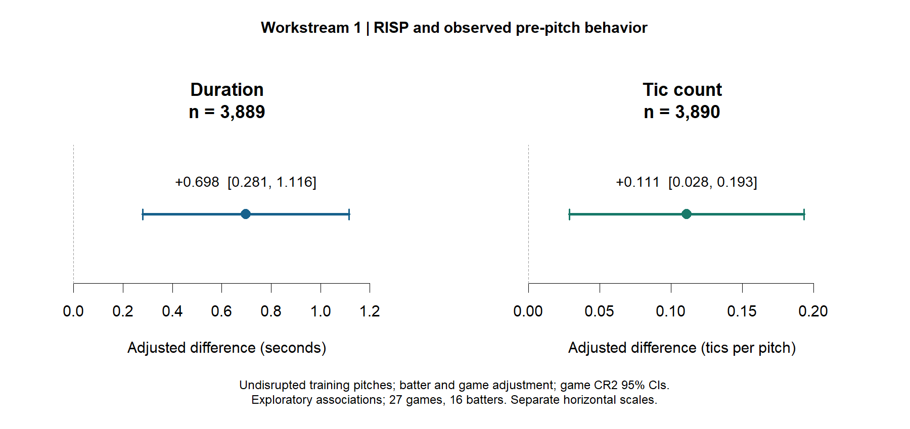

# Blue Jays Behavioral Analytics

An independent engineering and analytics portfolio studying recorded pre-pitch
behavior, game context and baseball outcomes. **Work in progress: Workstream 1's
initial exploratory analysis is complete; Workstreams 2–4 are under development.**

## Project scope

| Workstream | Question | Status |
|---|---|---|
| 1. Context and behavior | How do routine duration and recorded tics differ with RISP? | Initial analysis and summary complete |
| 2. Disruption and outcomes | How is pitcher disruption associated with PA outcomes? | Exposure/timing diagnostics next |
| 3. Outcome prediction | Can pre-pitch measurements help predict PA outcomes? | Chronological split and baseline prepared |
| 4. Game-level analysis | How do aggregated behavioral KPIs relate to game results? | Planned |

## Data and architecture

39 games, 17 recorded batters, 1,461 plate appearances and 5,634 pitches.
Core relational grain: game → plate appearance → pitch, with a batter dimension.
The package includes four core tables and four project-specific analytical tables.
Measurements are recorded as observed or calculated; no extrapolated data are
claimed. Missing values and eligibility flags are retained explicitly. One
calculated routine duration is excluded from primary duration models while its
observed tic counts remain eligible for tic analyses.

The chronological split assigns 27 games to training, six to validation and six
to test. Earlier predictor EDA used the full period; model fitting reported here
uses training records. Consult the research summary for precise exclusions and
limits; these counts alone are not an external authentication of observations.

## First exploratory findings

On undisrupted training pitches, with batter and game adjustment:

| Outcome | Adjusted RISP difference | Game CR2 95% CI |
|---|---:|---:|
| Routine duration | +0.698 seconds | +0.281 to +1.116 |
| Recorded total tics | +0.111 tics per pitch | +0.028 to +0.193 |



These are observational, exploratory associations. RISP is not a direct stress
measurement, and neither model establishes causality or a performance benefit.
The additive tic model has a small number of negative fitted counts; the report
documents this conditional-mean limitation. Nominal inference uses 27 game
clusters and assumes independence across games. Multiple specifications are
supporting checks on the same sample, not independent replications.

Read the [Workstream 1 research summary](deliverables/workstream1/WORKSTREAM1_RESEARCH_SUMMARY.md).

## Reproduce the saved summary

1. Open an RStudio project at the repository root.
2. Run `source("scripts/07_project1_summary.R")`.
3. Find the new tables and PNG under `outputs/project1/summary/`.

This summary script uses base R and reads the preserved completed-run CSVs. It
does not refit the models. Model scripts 04–06 also require `clubSandwich`:

```r
install.packages("clubSandwich")
source("scripts/04_project1_models.R")
```

Script 04 generates a new timestamped model run. Script 05 defaults to the archived
model RDS at `20261002_111847_28440`; to analyze a newly generated run, pass its RDS
path to `run_project1_sensitivity(model_path = "...")` after sourcing script 05.
Sourcing script 05 itself runs the archived default first. Script 06 creates a
new tic-model run independently. Script 07 deliberately reproduces the reviewed
milestone from its three specified archived runs; update those input paths
explicitly if producing a later milestone. Do not mix runs silently.

The reviewed user environment was R 4.6.1 on Windows with clubSandwich 0.7.0.
Exact session information and input hashes accompany each completed run. Package
versions are recorded, but an automated dependency lockfile is not yet supplied.
SQL Server load/validation scripts are in `scripts`; configure their local import
paths for your machine. SQL Server is not required merely to reproduce the R
summary from the CSV exports.

## Repository contents

- `data/`: core and project CSV exports.
- `metadata/`: schema, variable definitions, provenance and validation records.
- `scripts/`: SQL and R preparation, diagnostics, models and summary code.
- `outputs/`: timestamped run results, models, hashes and session information.
- `deliverables/`: reviewed research summaries, tables and figures.
- `docs/`: setup instructions and project notes.

Archival-package checksums in metadata describe the original package, including
files not copied to the repository. They are not a checksum list for every Git
checkout; individual run input hashes identify the inputs used in each analysis.

## Next milestone

Workstream 2 starts with `scripts/08_project2_diagnostics.R`. First-pitch disruption
is the candidate primary exposure; any disruption during a PA is retrospective
and depends on opportunities arising during that PA. Sparse exposed outcomes
must be assessed before selecting the regression specification.
