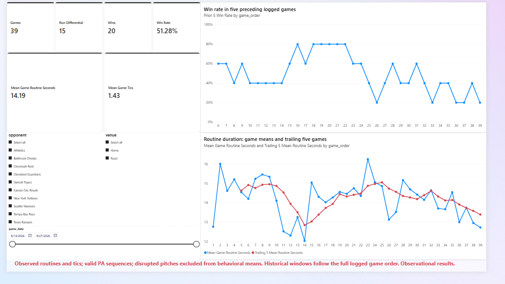

# Pre-Pitch Behavior and Game Outcomes

An observational baseball analytics portfolio connecting relational data engineering, statistical inference, chronological prediction evaluation, and Power BI reporting.

**Status:** All four initial analytical workstreams are complete. Repository review completed October 3, 2026; final dashboard detail and publication handoff are documented in the [release checklist](docs/NEXT_STEPS.md).

## Overview

This project studies recorded Toronto Blue Jays pre-pitch behavior across 39 logged games in August–September 2026. It asks how routine duration and tic counts vary with context, whether disruptions can be linked reliably to plate-appearance outcomes, and whether first-pitch behavior improves strikeout prediction on later games.

This is an independent student portfolio, without an institutional or team affiliation. The Management Engineering motivation is to connect process measurement and variation with defensible decisions. The study preserves sparse-data limitations and an unsuccessful predictive benchmark comparison as part of its findings.

## Main findings

| Workstream | Result |
|---|---|
| Context and behavior | After batter/game adjustment, RISP was associated with +0.698 seconds of routine duration and +0.111 recorded tics per pitch in the training cohort. |
| Disruption and strikeout | Only 13 training PAs had first-pitch disruption, including one strikeout. The sample was too sparse to support a reliable richly adjusted association estimate. |
| First-pitch prediction | The validation-selected behavior model did not beat prevalence on final test log loss: 0.480090 versus 0.475687. Brier score was also worse; test ROC-AUC was 0.541. |
| Game-level patterns | Prior-five-game win rate and current-game routine mean had descriptive Pearson r = 0.499 across 34 games. This does not establish causal momentum or a forecasting benefit. |

**The central finding:** contextual behavioral associations did not translate into a demonstrated improvement in later-period strikeout probability prediction with the selected model.

Read the [four-workstream synthesis](deliverables/portfolio/FOUR_WORKSTREAMS_SYNTHESIS.md) for interpretation and boundaries.

## Data and provenance

| Grain | Records |
|---|---:|
| Games | 39 |
| Batters | 17 |
| Plate appearances | 1,461 |
| Pitches | 5,634 |

The core tables are `games`, `batters`, `plate_appearances`, and `pitches`. Four project-specific CSV extracts support the analytical tasks; the supplied SQL build exposes them as views. The supplied measurements are declared observed or calculated, with none extrapolated. Calculated/missing values and sequence/outcome corrections remain flagged; eligibility rules select the appropriate cohort for each question. The [provenance record](metadata/provenance.json) and [data dictionary](metadata/data_dictionary.csv) document these distinctions. Source observations have not been independently authenticated against video or an official feed.

Analytical missing values were not replaced with zeros, and long observations were not discarded solely for being extreme. Three routine measurements remain missing. One calculated routine is excluded from observed-routine analyses while its separately observed tic count can remain eligible.

## Methods and tools

- **SQL Server / T-SQL:** relational tables, grain checks, joins, and analytical extracts.
- **R:** cohort diagnostics, linear models with game-clustered CR2 inference, logistic models, chronological validation, ridge and random-forest candidates, and descriptive game-level associations.
- **Power BI:** explicit DAX measures, game/pitch filtering, five-game history, and numerical reconciliation against R-derived references.
- **Git/GitHub:** versioned source, immutable run folders, input hashes, session records, and research reports.

Independent Python checks were used to reconcile exported data and numerical results. Their scope and engine limitations are recorded in the review files.

## Evaluation design

The prediction cohort contains one eligible first-pitch snapshot per PA. Train has 1,027 PAs across 27 games; Validation has 223 across six games; Test has 208 across six later games. Prediction time is after the first-pitch routine is observed and before the pitch outcome.

Candidate development used expanding chronological folds within Train. A fixed shortlist was selected by validation log loss. The selected model was refitted on Train plus Validation, then assessed once under the recorded final-test protocol. The Test is now used, and model selection is closed. Earlier predictor EDA across all dates is documented.

## Power BI preview



[Download the Power BI report](deliverables/workstream4/powerbi/dashboard.pbix). The [game details preview](deliverables/workstream4/game_details.png) shows the second page. Local data-source paths may need rebinding; see the reproduction guide.

The behavioral cards give each game equal weight. The model also contains separately named pitch-weighted measures. Rolling windows use logged game order, preserving doubleheaders; prior-five windows exclude the current game, and trailing-five windows include it.

## Reports

- [Workstream 1: RISP and behavior](deliverables/workstream1/WORKSTREAM1_RESEARCH_SUMMARY.md)
- [Workstream 2: disruption and strikeout](deliverables/workstream2/WORKSTREAM2_RESEARCH_SUMMARY.md)
- [Workstream 3: first-pitch prediction](deliverables/workstream3/WORKSTREAM3_RESEARCH_SUMMARY.md)
- [Workstream 4: game-level patterns](deliverables/workstream4/WORKSTREAM4_RESEARCH_SUMMARY.md)

## Repository structure

| Folder | Contents |
|---|---|
| `data/` | Core relational and project CSVs |
| `metadata/` | Schema, data dictionary, provenance, and validation records |
| `scripts/` | SQL, numbered R stages, and DAX definitions/checks |
| `outputs/` | Timestamped run artifacts and submitted Power BI QA records |
| `deliverables/` | Reviewed reports, tables, figures, and dashboard materials |
| `docs/` | Review checkpoints, verification records, and workflow instructions |

## Reproduction

Open `blue-jays-behavior-analytics.Rproj` and use the repository root as the working directory. A small base-R starting point is:

```r
source("scripts/01_import_R.R")
source("scripts/07_project1_summary.R")
```

The first command loads and checks the eight tables; the second regenerates the Workstream 1 summary from its archived estimates without refitting. See the [reproduction guide](docs/REPRODUCING.md) for every stage, package versions, SQL setup, the Power BI refresh path, and input-hash checks. Package versions are also recorded in each run's `sessionInfo.txt`.

For Power BI, import the three files from `outputs/project4/game_kpis/20261002_214708_23628/powerbi/` and follow `docs/POWERBI_BUILD_GUIDE.md`. Scripts 15 and 16 contain the DAX measures and QA queries. The submitted overall, venue, and game exports reconcile with independent numerical references.

The archive preserves individual stages and their dependencies using saved inputs. A fresh, automated end-to-end R run has not been validated. Native execution evidence is the author's saved R runs; the repository review independently checked file integrity, relational reconstruction, and supplied QA exports. The review environment could not execute R, SQL Server, or Power BI Desktop. Current status is in the [repository review](docs/REPOSITORY_REVIEW_20261003.md).

## Limitations

This is an observational study of one short, team-specific window. RISP is not a direct measure of stress, and the recorded tic variables are not clinical measures. Workstream 1 inference assumes independent game clusters; Workstream 2's sparse-table uncertainty uses an independent-PA reference; Workstream 4 correlations are descriptive and unadjusted. None of these findings establishes a causal intervention effect.

The selected prediction model did not demonstrate superiority to a simple prevalence baseline on the six test games. Its 81.73% accuracy at a 0.5 threshold came with zero strikeout recall, confirming it is not a useful classifier. This weak predictive signal highlights the highly stochastic nature of batter-pitcher matchups, where terminal outcomes are dominated by physical execution and pitch mechanics rather than pre-pitch behavioral pacing. Further predictive development would require fresh evaluation data and likely the integration of kinematic or biomechanical tracking features.
