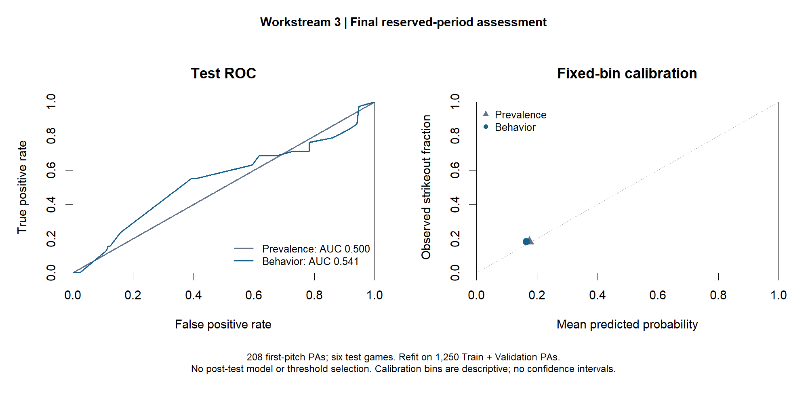

# Workstream 3 — First-pitch strikeout prediction

Status: final reserved-period assessment reviewed on 2026-10-02. The initial modeling cycle is complete. Test has been used; model selection is closed.

## Main finding

The validation-selected behavior model did not outperform a prevalence-only benchmark on the six reserved test games. Its test log loss was 0.480090 versus 0.475687 for the benchmark, and its Brier score was 0.150350 versus 0.149385. ROC-AUC was 0.541, showing weak ranking performance in this sample. These results do not establish a useful predictive improvement from the measured routine duration and tic count for this team and observation period.

This is a finding about the specified model, cohort, and evaluation period. It does not establish that all behavioral signals are uninformative, or that the observed score differences would persist in other games.

## Question, timing, and cohort

The target was whether a plate appearance ended in a strikeout. Prediction time was after the first-pitch routine had been observed and before the first-pitch outcome. The behavior model used the natural logarithm of that routine's duration and its observed tic count. It did not use subsequent pitches or the final plate-appearance outcome as predictors.

The analytical source was the eligible first-pitch subset of `data/project3_snapshots.csv`, with one row per plate appearance. It contained 1,458 PAs. This is smaller than the 1,461-PA core log because the prediction cohort applies its documented measurement, sequence, and outcome eligibility rules. Observed and calculated provenance remains in the underlying database; no extrapolated measurements were introduced.

| Partition | Games | PAs | Strikeouts | Role |
|---|---:|---:|---:|---|
| Train, through September 13 | 27 | 1,027 | 185 | Chronological development |
| Validation, September 14–20 | 6 | 223 | 33 | Frozen shortlist selection |
| Test, September 21–27 | 6 | 208 | 38 | Final assessment |

All dates are in 2026. Games, including doubleheaders, remain separate chronological units. Earlier full-period predictor EDA was documented; this should not be described as a completely untouched test dataset in every respect. The held-out target evaluations followed the recorded selection sequence.

## Development and selection record

Scripts 10 and 11 evaluated candidates in three expanding chronological folds inside Train. There were 576 assessment PAs and 103 strikeouts across the folds. Candidate families included a prevalence benchmark, logistic context/behavior models, ridge models with player/context features, and probability random forests. Feature encoding for the richer models was learned within each fitting window, with unseen categories audited.

The simple behavior model had pooled development log loss 0.469746 versus 0.470701 for prevalence. Richer candidates had worse log loss; further candidate construction stopped. The frozen shortlist was M0 prevalence and M2 behavior. Script 12 selected the lower validation log loss, with ties within 1e-12 assigned to M0. No threshold optimization or recalibration was performed.

| Validation model | Log loss | Brier score | ROC-AUC |
|---|---:|---:|---:|
| M0 prevalence | 0.422873 | 0.127117 | 0.500000 |
| M2 behavior | 0.422700 | 0.127144 | 0.523923 |

M2 won the predefined primary criterion by only 0.000173 in log loss, approximately 0.041%. It already had slightly worse validation Brier score. Selection under the rule did not imply a substantial improvement.

The development benchmark's pooled AUC of 0.439828 should not be confused with its within-fold AUC of 0.5. Its constant prediction varied between fitting windows; pooling those windows can change rank-based AUC.

## Final refit and test assessment

Script 13 refitted M2 on the combined 1,250 Train and Validation PAs from 33 games, containing 218 strikeouts. The comparator used the corresponding fixed prevalence, 218/1,250 = 0.1744. The fitted objects and assessment plan were saved before evaluating Test.

The final linear predictor was:

`logit(p) = -3.0847215373 + 0.6458971143 * log(routine_time_secs) - 0.0989100046 * total_tics`

These coefficients describe the prediction model; they are not causal effects or clustered inferential estimates.

| Final test model | Log loss, lower is better | Brier, lower is better | ROC-AUC, higher is better | Mean predicted risk |
|---|---:|---:|---:|---:|
| M0 prevalence | 0.475687 | 0.149385 | 0.500000 | 17.44% |
| M2 behavior | 0.480090 | 0.150350 | 0.540557 | 16.51% |

M2 minus M0: log loss +0.004403, Brier +0.000965, AUC +0.040557. Log loss was approximately 0.93% worse. The test strikeout rate was 38/208 = 18.27%; both models underpredicted average risk, with M0 closer. M2 had lower game-specific log loss in three test games and higher log loss in three.

At the diagnostic threshold of 0.5, both models predicted zero strikeouts: TP 0, FP 0, TN 170, FN 38. Their 81.73% accuracy therefore coexists with zero strikeout recall; accuracy is not evidence of useful classification. Precision is undefined because there were no positive predictions.

All test predictions fell into the same fixed calibration bin, (0.1, 0.2]. The calibration figure shows one point per model, not enough occupied bins to assess calibration shape. No confidence intervals or formal model-comparison p-values are claimed. Six test games provide limited evidence about future performance, and PAs within games should not be treated as independent replications for uncertainty estimates.

## Decision and reproducibility

Retain the validation-selected model and report its unsuccessful benchmark comparison. Do not use these test results to choose another candidate, optimize a threshold, or recalibrate and then report the same Test as fresh evidence. Future model development would need new evaluation data.

The reviewed final run is `outputs/project3/final_test/20261002_205859_23628/`. Its 20 original files are archived unchanged, including the exact R script, fitted-model RDS, result RDS, predictions, metrics, ROC points, plot, console log, session information, cohort IDs, and input hashes.

Independent Python verification matched all 18 recorded input hashes, reproduced the logistic refit, checked all 416 model–PA predictions, 12 game/model metric rows, both calibration summaries, both ROC areas, cohort membership, and score differences. Maximum prediction discrepancy was approximately 5.05e-14. R was unavailable in the review environment: RDS files were preserved byte-for-byte, not deserialized there. See `docs/PROJECT3_FINAL_TEST_VERIFICATION.json`.

The private GitHub repository remains the project archive. Workstream 4 proceeds as a separate descriptive game-level analysis and does not reopen Workstream 3 selection.
