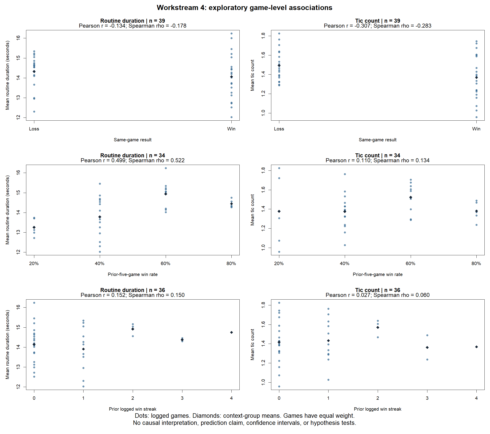

# Workstream 4: game-level results and recent history

Analytical draft generated by script 17; independent review pending.

## Scope

The study contains 39 logged games, 20 wins and 19 losses. The Power BI numerical checkpoint reproduced overall, venue, and individual-game results.
The analysis below describes game-level associations. It does not estimate causal effects or forecast game wins.

## Six exploratory comparisons

| ID | Context | Behavioral mean | Games | Pearson r | Spearman rho |
|---|---|---|---:|---:|---:|
| A1 | Same-game result | Mean routine duration (seconds) | 39 | -0.134 | -0.178 |
| A2 | Same-game result | Mean tic count | 39 | -0.307 | -0.283 |
| A3 | Prior-five-game win rate | Mean routine duration (seconds) | 34 | 0.499 | 0.522 |
| A4 | Prior-five-game win rate | Mean tic count | 34 | 0.110 | 0.134 |
| A5 | Prior logged win streak | Mean routine duration (seconds) | 36 | 0.152 | 0.150 |
| A6 | Prior logged win streak | Mean tic count | 36 | 0.027 | 0.060 |

Positive coefficients indicate larger behavioral means at larger context values; negative coefficients indicate smaller means. Values describe these logged games only.

## Win/loss contrasts

| Behavioral measure | Mean in wins | Mean in losses | Win minus loss |
|---|---:|---:|---:|
| routine_undisrupted_mean_secs | 14.0614 | 14.3269 | -0.2655 |
| tics_undisrupted_mean | 1.3676 | 1.4941 | -0.1264 |

## Single-game influence

| ID | Full-cohort Pearson r | Leave-one-out minimum | Leave-one-out maximum | Any sign change? |
|---|---:|---:|---:|---|
| A1 | -0.134 | -0.201 | -0.084 | No |
| A2 | -0.307 | -0.361 | -0.271 | No |
| A3 | 0.499 | 0.462 | 0.538 | No |
| A4 | 0.110 | 0.006 | 0.227 | No |
| A5 | 0.152 | 0.115 | 0.214 | No |
| A6 | 0.027 | -0.022 | 0.094 | Yes |

These ranges measure influence; they are not confidence intervals. See the separate streak-boundary sensitivity and context-group support tables.

## Interpretation limits

- Exploratory analysis after prior EDA, not a preregistered confirmatory study. Six fixed comparisons are reported together.
- Each observation is one game. Responses are means of observed, undisrupted measurements from valid PA sequences.
- Games have equal weight; results are not estimated using 5,634 independent game-outcome observations.
- Same-game win comparisons use 39 games. Win status and full-game behavior are retrospective; these are not pregame forecasts.
- Prior-five-game history uses 34 games, excluding the first five without a complete recorded history.
- Primary streak comparisons use 36 games after the first observed loss. The first three pregame streak lengths may extend before this dataset.
- A named sensitivity uses all 39 window-truncated streak values; it is not used to choose the preferred result.
- Pearson r summarizes linear association; with binary win it is a point-biserial correlation. Spearman rho correlates average ranks, retaining ties.
- No p-values or confidence intervals: serial dependence, overlapping history windows, small sample size, and multiple exploratory comparisons limit inference.
- Leave-one-game-out values assess single-row influence, not uncertainty. Historical exposure values remain fixed after removing a row.
- Dependence may persist even if leave-one-out signs are stable. No adjustment for batter mix, opponent, game order, venue, or other confounding is performed.
- Correlation with a prior win streak is not proof of psychological momentum or of an effect of behavior on winning.
- This analysis does not reopen Workstream 3's completed test or select a new predictive model.
- No raw observations were edited, imputed, extrapolated, trimmed, or winsorized.
- The final Power BI presentation review and overall portfolio integration remain separate completion steps.

## Reproducibility

Run folder: `outputs/project4/associations/20261003_194642_19800`.
The run includes exact pair membership, point-level data, coefficients, all leave-one-out results, support counts, the source script, input hashes, RDS, and session information.
